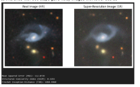

model files are in https://drive.google.com/drive/folders/1O_Z_LsvIDgHmQXMLTuxXXIkzccImfd43?usp=sharing


Enhancing Astronomy Images

1  Introduction 

The goal of the project is to enhance astronomy images for better analysis.Three main steps for this are:-

- Image Colorisation
- Image Super-Resolution via sr3
- Image Denoising

2  Image Colorisation

For image colorisation, we used U-Net with Conditional GAN to colorize Black and White astro- nomical images.

1. Dataset Prepration

The dataset used for training the models is comprised of color images.. For training purposes, these color images are converted to grayscale. A large dataset of colored images is essential for training a deep learning model to learn the relationships between grayscale images and their corresponding colored versions. The dataset used in our project is Galaxy10DECals.

Some images fron dataset are:-

[https://astronn.readthedocs.io/en/latest/galaxy10.html.](https://astronn.readthedocs.io/en/latest/galaxy10.html)

Processing:-

- Convert the colored images to grayscale (as input) and keep the original color images (as output)
- Normalize the pixel values to be between 0 and 1.
- Resize the images to a uniform size (64x64) for easier processing by the model.
2. U-Net Architecture

U-Net is a type of convolutional neural network (CNN) primarily designed for image segmentation tasks, but it has proven to be very effective in tasks like image colorization.

The architecture consists of an encoder-decoder structure with skip connections .

- Encoder : The encoder extracts the features from the input grayscale image through several convolutional layers followed by max-pooling layers. It reduces the spatial dimensions of the input image while increasing the number of feature maps (channels).
- Decoder : The decoder up-samples the features back to the original image size using up- convolutional layers (transpose convolutions). The output of each up-sampling step is concate- nated with the corresponding feature map from the encoder path (via skip connections). This helps the model retain fine-grained details from the original input.
- The final output layer of the U-Net generates an image with 3 channels (for RGB colorization) and the same dimensions as the input image.
3. Conditional GAN (cGAN) for Enhanced Image Generation

A Conditional GAN (cGAN) is used here, where the generator is conditioned on the grayscale input images to produce the corresponding colorized images.

Model details:-

- The generator takes the grayscale image as input and tries to generate a colorized image.
- The discriminator receives both the generated colorized image and the original (real) colorized image and tries to classify them as real or fake.
- The generator and discriminator are trained simultaneously. The generator tries to improve by fooling the discriminator, while the discriminator learns to better distinguish between real and fake images.
- The generator uses the U-Net architecture to generate colorized images, while the discriminator uses a series of convolutional layers to predict whether an image is real or fake.
4. Loss Functions
1. Loss for the Generator: The generator has two main components of the loss function
- L1 loss (MSE loss) : Measures the pixel-wise difference between the generated image and the ground truth (real colorized image).

LL1(G) = Ex,y,z [∥y − G(x,z)∥1].

- Adversarial loss : A binary cross-entropy loss that encourages the generator to produce images that are classified as real by the discriminator.

LGAN(G,D) = Ex,y [logD(y)] + Ex,z [log(1 − D(G(x,z)))] .

2. Loss for the Discriminator: The discriminator uses binary cross-entropy loss to classify images as real or fake. It receives the real image and the generated image and tries to correctly classify them.
5. Training the Model

The training process involves alternating between training the generator and the discriminator.

- Generator : The generator is trained by minimizing both the adversarial loss and the L2 loss. The generator tries to create colorized images that not only resemble the real ones in color but also ”fool” the discriminator into classifying them as real.
- Discriminator : The discriminator is trained to differentiate between real and fake colorized images. It helps the generator improve by providing feedback about the quality of the generated images.
- The two models are trained together in an adversarial manner, where the generator tries to get better at fooling the discriminator, and the discriminator gets better at distinguishing between real and fake images.

Training Code File: colorization.ipynb

6. Results

 

Fig 1 Original Image Fig 2 Colorized Image

Test Code File: show.ipynb

Output folder: Colored Images

3  Image super resolution via sr3

The SR3 (Score-Based Generative Model for Super-Resolution) model introduces a diffusion probabilis- tic model for image super-resolution, leveraging score-based learning to iteratively refine low-resolution images into high-resolution counterparts. It employs a noise-conditioned score network that predicts the gradient of the log density of data distribution at varying noise levels, enabling effective denoising and resolution enhancement.

1. Model features
1. Big GAN Architecture adaptation 
- Adopt G blocks in DDPM residual blocks in Unet
- Multi-scale features
- Spatial Attention
- Conditioning on additional inputs (noise parameter gamma)
2. Noise Scheduling:-

   The model conditions on directly on gamma (vs t ), which allows us flexibility in choosing number of diffusion steps, and the noise schedule during inference.Prior work of diffusion models require 1-2k diffusion steps during inference, making generation slow for large target resolution tasks.We can chose number of steps for inference flexibly without training the multiple models which makes this cost effective.

T 1

p(γ) = T t−1,γt),

U(γ piecewise distribution t=1

t ∼ {0,...,T }, T = 2000 U(γt−1,γt)

3. Conditional Diffusion

   To help reverse the diffusion process,we take advantage of additional side information in the form of source image and a noisy target image y, and take as input the sufficient statistics for the variance of the noise.(gamma)

   

4. Score matching based loss function

   This approach builds on denoising score matching, which learns a parametric score function to approximate the gradient of the data log-density. Following Song and Ermon’s multiscale Gaus- sian mixture method, they perturb data with varying Gaussian noise levels, enabling effective sampling via Langevin dynamics.

2. Experimentation
1. The dataset is Galaxy10 DECaLS . It contains high-resolution, multi-band images covering a wide range of galaxy types, used for training machine learning models to classify galaxies and analyze their features. It has 10 classes .
1. Super resolution 64\*64 to 128 \* 128
1. First I tried with pretrained model , the pretrained model is trained on faces , it showed bad results as expected.

   

4. Then I trained on the dataset . It has a lot of noise in the output.

   

5. This may be because the images in the dataset have lots of noise . The model may be amplifying the noise too

   

6. So , I tried to remove this noise using bilateral filter , and then train on denoised images.

   

7. Training on this denoised dataset gave better results.

   

8. As described in Model features, here we have flexibility over choosing number of inference steps.
8. inference with 500 steps gave noisy images with lower scores

   

10. Inference with 1000 steps gave better results

    

11. Inference with 2000 steps gave best results

    

12. However I found coupling a bilateral filter with 1000 inference steps gave good results too.This can be a good strategy to save time and resources.

    

13. Finally we tested our pipeline with 100 grayscale images , colored and then super resolution coupled with a bilateral filter.

    

    For the 100 test images for the pipeline , we got

    Average (SSIM): 0.857 with highest (SSIM):0.943

    Test samples of the pipeline are in experiments/1

    Note:

    Testing face image on fine tuned model producing traces of stars .

    

Are these stars proof of what the model learnt ? Can we trace features of train images ? The above inference images are in Samples folder.

4  Denoising Part

When we tried to classify the images as they are actually from a classification dataset .we found the objectual noise in the images like red dots , blue spheres etc are disturbing the classification.

Ideally they should not be involved and a classifier should only take the main structure into account. We wanted to remove this kind of object from the image .

1. Auto removal UNET

We created a dataset manually to train a U-Net model for noise removal. To enhance the diversity and robustness of the dataset, we applied various data augmentation techniques.The pretrained U-Net model was trained on ImageNet with ResNet34 as backbone. The U-Net model was trained for 100 epochs using this dataset; however, the output results were not satisfactory, indicating that the model did not effectively learn to remove noise.

Handmade Dateset: new-set Code File: denoise unet.ipynb

2. Classical Technique

Since the auto removal method didnt work well. We came up with a combination of classical cv methods . However one particular method didn’t work for all images . So we came up with different methods for different classes .

We explain one case by an example .

1. The simple way can be template matching with noisy spheres.

   

   However this removes the original features of the image often.

2. Changing matching thresholds and adding scale matching with template

   

3. Adding color matching thresholds.

   

4. Removing these kinds of objects and inpainting gives clear images.
4. Classification accuracy on training with these filtered images increased by 4%. Model denoised Accuracy: 94.05%

   Model non denoise Accuracy: 90.67%

   Files related to this technique are in noise folder.

## Acknowledgments

We thank the creators of the SR3 PAPER  [Image-Super-Resolution-via-Iterative-Refinement](https://github.com/Janspiry/Image-Super-Resolution-via-Iterative-Refinement) as we have taken  foundation modules for this project from them .

